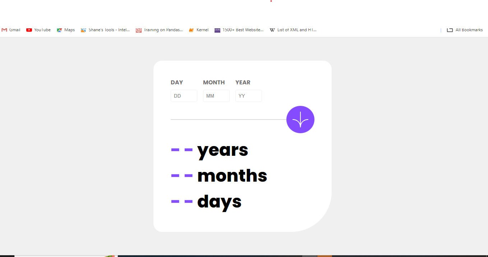

# Frontend Mentor - Age calculator app solution

This is a solution to the [Age calculator app challenge on Frontend Mentor](https://www.frontendmentor.io/challenges/age-calculator-app-dF9DFFpj-Q). Frontend Mentor challenges help you improve your coding skills by building realistic projects.

## Table of contents

- [Overview](#overview)
  - [The challenge](#the-challenge)
  - [Screenshot](#screenshot)
  - [Links](#links)
- [My process](#my-process)
  - [Built with](#built-with)
  - [What I learned](#what-i-learned)
  - [Continued development](#continued-development)
  - [Useful resources](#useful-resources)
- [Author](#author)
- [Acknowledgments](#acknowledgments)

**Note: Delete this note and update the table of contents based on what sections you keep.**

## Overview

This project is an age calculator project that allows you input a date and get the age in years, months and days

### The challenge

Users should be able to:

- View an age in years, months, and days after submitting a valid date through the form
- Receive validation errors if:
  - Any field is empty when the form is submitted
  - The day number is not between 1-31
  - The month number is not between 1-12
  - The year is in the future
  - The date is invalid e.g. 31/04/1991 (there are 30 days in April)
- View the optimal layout for the interface depending on their device's screen size
- See hover and focus states for all interactive elements on the page
- **Bonus**: See the age numbers animate to their final number when the form is submitted

### Screenshot

### Links

<!--
- Solution URL: [Add solution URL here](https://your-solution-url.com)
- Live Site URL: [Add live site URL here](https://your-live-site-url.com) -->

## My process

This project is built with Semantic HTML, CSS and Javascript. A form element was used in the html page and each div in it had a label and an input Javascript was used to add functionality

### Built with

- Semantic HTML5 markup
- CSS custom properties
- Flexbox
- Mobile-first workflow
- javascript

### What I learned

Some of the things i learnt while working on this project include working with the date object. i had to create a couple of date object to work it out

### Continued development

In the nearest future from the time of publishing this i hope to animate the process of the age appearance

## Author

## Author

- Website - [https://portfolio-7t2.pages.dev/]
- Name - [Omilani Michael Olugbenga]
- Frontend Mentor - [@MICHAEL10000000](https://www.frontendmentor.io/profile/MICHAEL10000000)
- Twitter - [@GbengaOmilani](https://www.twitter.com/GbengaOmilani)
